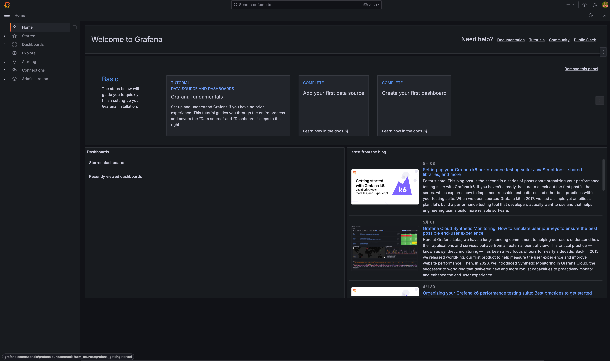
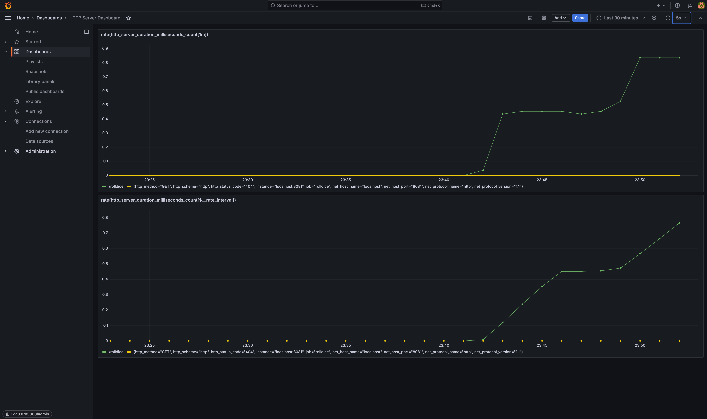

# grafana-otel-lgtm-playground

## Getting Started

### Run grafana/otel-lgtm

```shell
docker compose up
```

### Open Grafana Web UI

```shell
open http://127.0.0.1:3000  
```

#### Default account credential

- username: `admin`
- password: `admin`




### Serve Example Server

```shell
cd docker-otel-lgtm/examples/go 
./run.sh
```

### Generate Traffic

```shell
while :; do clear; http GET http://localhost:8081/rolldice; sleep 1; done
```

### Create Dashboard

```text
rate(http_server_duration_milliseconds_count[1m])
rate(http_server_duration_milliseconds_count[$__rate_interval])
```



## References

- [An OpenTelemetry backend in a Docker image: Introducing grafana/otel-lgtm | Grafana Labs](https://grafana.com/blog/2024/03/13/an-opentelemetry-backend-in-a-docker-image-introducing-grafana/otel-lgtm/)
- [grafana/docker-otel-lgtm](https://github.com/grafana/docker-otel-lgtm)
